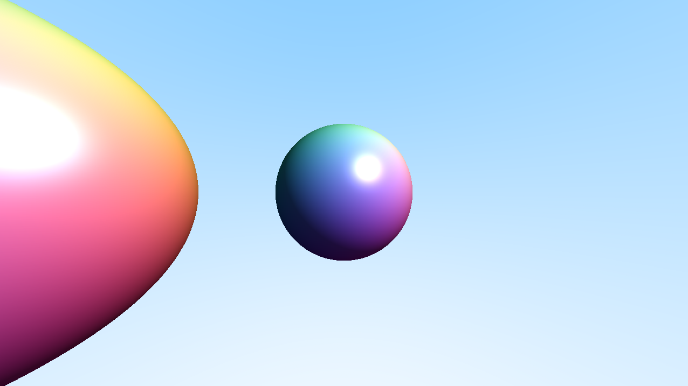
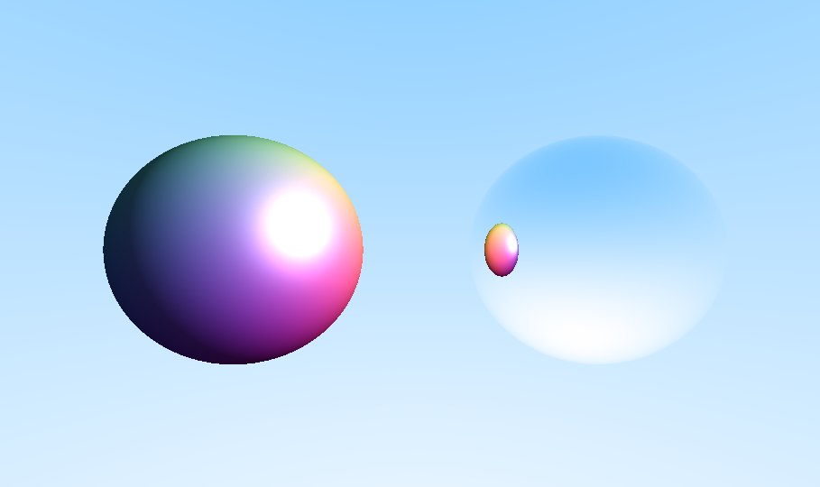
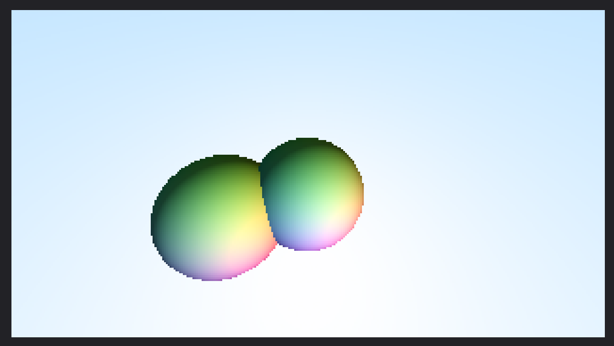
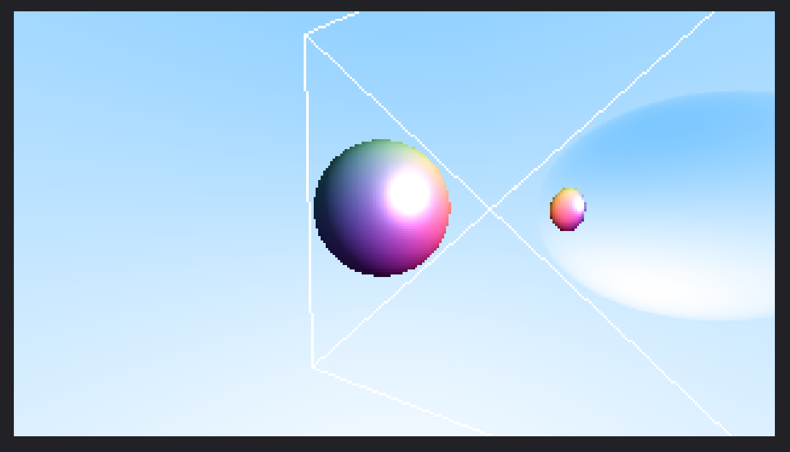

# Linear Algebraic Ray Tracer

A full ray tracing engine built from scratch using **linear algebra as the core mathematical framework**, featuring object-space transformations, camera view and projection matrices, physically inspired lighting, recursive reflections, and real-time camera control using PyGame.

This project demonstrates that an entire 3D rendering pipeline can be implemented almost entirely using **matrix transformations, dot products, vector normalization, and coordinate space changes**.

**Authors**
- Anson Wang
- Jason Ding

---

## Core Rendering Pipeline

All objects are defined as **unit spheres at the origin in object space**. They are transformed into world space using **4×4 homogeneous transformation matrices**:

Object Space → World Space → Camera Space → Clip Space → NDC → Screen Space

Instead of intersecting rays with transformed objects directly, **rays are transformed into object space using the inverse matrix**:

M = T · S  
M⁻¹ = inverse(M)

This allows every object to be treated as a default unit sphere, greatly simplifying intersection math.

---

## Object Transformations

Each sphere has:
- A transformation matrix M
- An inverse matrix M⁻¹

World-space ray components are converted into object space:

O_local = M⁻¹ O_world  
D_local = M⁻¹ D_world

This allows all intersections to be computed in canonical form.

---

## Ray–Sphere Intersection

Ray equation:

r(t) = O + tD

For a unit sphere:

||O + tD||² = 1

Which expands to:

at² + bt + c = 0

Where:

a = D · D  
b = 2(O · D)  
c = O · O − 1  

Discriminant:

Δ = b² − 4ac

The **smallest positive root** of the quadratic is selected as the hit distance.

---

## Surface Normals

For a unit sphere in object space:

N = P / ||P||

Normals are:
1. Computed in object space
2. Transformed back into world space
3. Renormalized

---

## Camera Coordinate System and View Matrix

The camera frame is defined using an orthonormal basis:

f = normalize(lookAt − pos)  
r = f × WORLD_UP  
u = r × f  

The resulting view matrix:

| rx  ry  rz  −r·pos |
| ux  uy  uz  −u·pos |
|−fx −fy −fz   f·pos |
|  0   0   0     1   |

This matrix converts world coordinates into camera space.

---

## Perspective Projection

Projection matrix:

| f/A  0    0          0 |
|  0   f    0          0 |
|  0   0  (n+f)/(n−f)  2nf/(n−f) |
|  0   0   −1         0 |

After projection:

(x, y, z)_ndc = (1/w) · (x, y, z)

Mapped into screen space:

[0, width] × [0, height]

---

## Lighting Models

### Lambertian Diffuse

diff = max(0, N · L)

---

### Blinn–Phong Specular

H = normalize(L + V)  
spec = max(0, N · H) ^ SHINE

---

## Recursive Reflections

Reflection direction:

R = D − 2(D · N)N

Reflections are traced recursively until:

DEPTH_MAX = 2

Local and reflected colors are blended using the object’s reflectivity value.

---

## Sky Gradient Background

Vertical interpolation:

t = (dir.y + 1) / 2

This blends between the ground color and sky color.

---

## Live Camera Controls

- W / S → move forward / backward
- A / D → strafe left / right
- Space / Shift → move up / down
- Mouse → yaw and pitch

Current performance: ~0.5 FPS  
Planned future optimization via Numba or a lower-level rewrite.

---

## Wireframe Projection

A real-time projected unit cube is rendered using:
- 8 vertices
- 12 edges
- Shared camera projection pipeline

Rendered directly over the ray-traced scene for verification.

---

## Inline Image Templates (Drop Your Images Here)

### Scene With Increasing Depth

### Specular Highlights

### Recursive Reflections

### Live Camera View (PyGame)

### Wireframe Projection Overlay

---

## Running the Project

### Generate a Static Ray-Traced Image

python genImage.py  
xdg-open output.ppm

---

### Run Live Camera Mode

python live.py

---

## Project Structure

.
├── camera.py  
├── geometry.py  
├── scene.py  
├── ray.py  
├── render.py  
├── util.py  
├── genImage.py  
├── live.py  
├── assets/  
│   ├── depth_scene.png  
│   ├── specular.png  
│   ├── reflection.png  
│   ├── live_view.png  
│   └── wireframe.png  
├── report.pdf  
└── README.md  

---

## References

- Lambertian Reflectance – Wikipedia  
- Rodrigues’ Rotation Formula – Wikipedia  
- OpenGL Matrix Transformations – opengl-tutorial.org  

---

## Future Work

- Numba acceleration
- Multiple light sources
- Triangle meshes
- Shadow rays
- Bounding volume hierarchy (BVH)
- Anti-aliasing
